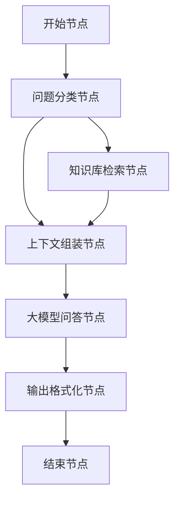
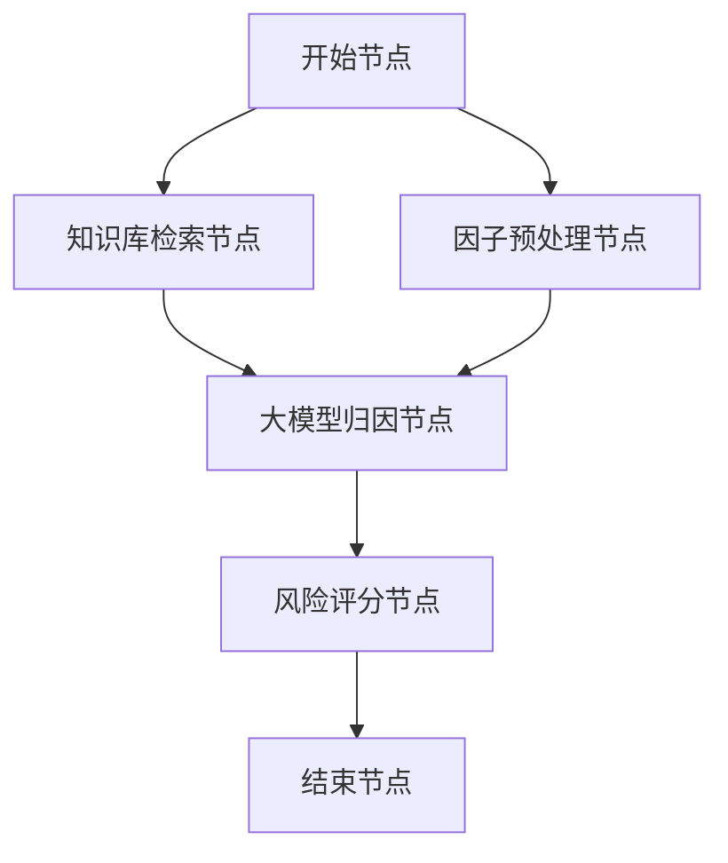
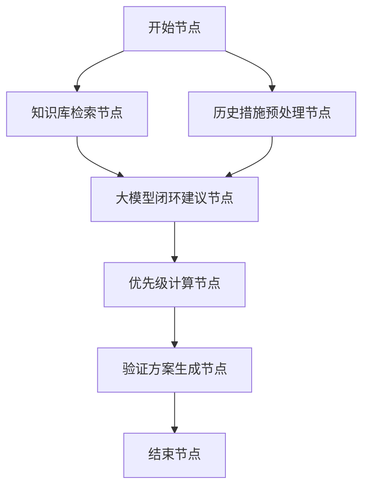

# Dify Workflow 详细技术设计

本文档详细描述三个 Dify Workflow 的每个节点、节点类型、输入输出变量、大模型节点的完整 Prompt。

---

## 总体说明

### 调用方式

三个 Workflow 均通过 Dify 的 Workflow API 被后端 FastAPI 服务调用。

调用流程：

```text
前端 → FastAPI 后端 → 数据查询与预处理 → 调用 Dify Workflow API → 解析返回 → 前端展示
```

### Dify Workflow API 调用格式

```http
POST {DIFY_BASE_URL}/v1/workflows/run
Authorization: Bearer {API_KEY}
Content-Type: application/json
```

```json
{
  "inputs": {},
  "response_mode": "blocking",
  "user": "quality-platform-user"
}
```

### 变量命名约定

- 所有输入变量使用 `snake_case`
- 所有输出变量使用 `snake_case`
- JSON 字符串类型的变量在传入前由后端序列化
- Dify 内的代码节点只负责轻量预处理，不承担复杂业务计算
- 复杂统计分析放在 FastAPI 后端完成，再将摘要结果传给 Dify

---

## Workflow 1：智能问答分析

### 1.1 Workflow 概览



### 1.2 Workflow 输入变量

在开始节点定义以下输入变量：

| 变量名 | 类型 | 必填 | 说明 |
|--------|------|------|------|
| `user_question` | String | 是 | 用户的自然语言问题 |
| `query_result_json` | String | 是 | 后端根据问题预查询的结构化数据，JSON 字符串 |
| `time_range` | String | 否 | 查询时间范围 |
| `filter_model` | String | 否 | 筛选车型 |
| `filter_station` | String | 否 | 筛选工位 |
| `filter_shift` | String | 否 | 筛选班次 |
| `query_mode` | String | 否 | 查询模式，如 summary/detail/trend |

### 1.3 节点 1：问题分类节点

- 节点名称：`question_classifier`
- 节点类型：LLM 节点
- 用途：判断用户问题属于哪个类别

#### 输入

- `user_question`

#### 推荐模型参数

- Temperature：`0.1`
- Max Tokens：`50`

#### System Prompt

```text
你是一个整车制造质量管理领域的问题分类器。

你的任务是将用户的问题分类到以下类别之一：

1. DEFECT_STATISTICS - 缺陷统计类问题
   示例：最近一周缺陷数量是多少、TOP5缺陷是什么、缺陷率趋势如何

2. STATION_ANALYSIS - 工位分析类问题
   示例：哪个工位问题最多、某工位的质量表现如何

3. SUPPLIER_ANALYSIS - 供应商分析类问题
   示例：某供应商的不良率如何、哪个供应商批次有问题

4. SHIFT_COMPARISON - 班次对比类问题
   示例：白班和夜班质量差异、某班组的表现如何

5. VEHICLE_QUERY - 单车查询类问题
   示例：某VIN的检验记录、某订单号的质量情况

6. TREND_ANALYSIS - 趋势分析类问题
   示例：缺陷率是上升还是下降、最近的质量变化趋势

7. GENERAL - 通用质量问题
   示例：如何改善质量、质量管理建议

输出要求：
- 只输出一个分类标签
- 不要输出解释
- 不要输出 JSON
- 不要输出标点

用户问题：
{{user_question}}
```

#### 输出变量

- `question_type`

---

### 1.4 节点 2：知识库检索节点

- 节点名称：`knowledge_retrieval`
- 节点类型：知识检索节点
- 知识库：`quality_knowledge_base`
- 用途：检索与问题相关的质量知识

#### 配置建议

- 检索模式：混合检索
- TopK：`5`
- 分数阈值：`0.5`
- 查询变量：`user_question`

#### 输出变量

- `knowledge_context`

---

### 1.5 节点 3：上下文组装节点

- 节点名称：`context_builder`
- 节点类型：代码执行节点
- 语言：Python3
- 用途：组装统一上下文

#### 输入

- `question_type`
- `query_result_json`
- `knowledge_context`
- `user_question`
- `time_range`
- `filter_model`
- `filter_station`
- `filter_shift`
- `query_mode`

#### 代码

```python
import json

def main(question_type: str, query_result_json: str, knowledge_context: str,
         user_question: str, time_range: str = "", filter_model: str = "",
         filter_station: str = "", filter_shift: str = "", query_mode: str = "") -> dict:

    context_parts = []

    context_parts.append(f"问题类别：{question_type}")
    context_parts.append(f"用户问题：{user_question}")

    filters = []
    if time_range:
        filters.append(f"时间范围：{time_range}")
    if filter_model:
        filters.append(f"车型：{filter_model}")
    if filter_station:
        filters.append(f"工位：{filter_station}")
    if filter_shift:
        filters.append(f"班次：{filter_shift}")
    if query_mode:
        filters.append(f"查询模式：{query_mode}")

    if filters:
        context_parts.append("筛选条件：" + "，".join(filters))

    try:
        parsed = json.loads(query_result_json)
        pretty_json = json.dumps(parsed, ensure_ascii=False, indent=2)
        context_parts.append(f"结构化查询结果：\n{pretty_json}")
    except Exception:
        context_parts.append(f"结构化查询结果：\n{query_result_json}")

    if knowledge_context:
        context_parts.append(f"相关质量知识：\n{knowledge_context}")

    assembled_context = "\n\n".join(context_parts)

    return {
        "assembled_context": assembled_context
    }
```

#### 输出变量

- `assembled_context`

---

### 1.6 节点 4：大模型问答节点

- 节点名称：`llm_qa`
- 节点类型：LLM 节点
- 温度：`0.3`
- 最大 Token：`2048`

#### 输入

- `user_question`
- `assembled_context`

#### System Prompt

```text
你是一位资深的整车制造质量管理专家，服务于汽车整车制造工厂的质量管理平台。

你的职责是根据提供的结构化质量数据和知识库信息，回答质量管理人员的问题。

## 回答原则

1. 必须基于提供的数据进行回答，不要编造数据
2. 如果数据不足以回答问题，明确说明缺少哪些数据
3. 回答要先给结论，再给分析
4. 涉及数字时必须引用具体数据
5. 对异常波动要提示潜在风险
6. 在适当时给出改善建议
7. 使用中文回答
8. 不能把知识库中的经验当成已经发生的事实
9. 不能输出与输入数据无关的泛泛而谈内容

## 输出格式要求

严格输出 JSON，不要输出 JSON 之外的任何内容：

{
  "summary": "一句话结论摘要",
  "analysis": "详细分析内容，支持 markdown",
  "risk_alerts": ["风险提示1", "风险提示2"],
  "suggestions": ["改善建议1", "改善建议2"],
  "follow_up_questions": ["建议追问1", "建议追问2"],
  "chart_recommendation": {
    "chart_type": "bar|line|pie|heatmap|table|none",
    "chart_title": "图表标题",
    "description": "建议图表展示内容"
  },
  "confidence": "高|中|低"
}

## 分析要求

- 如果问题是统计类，重点回答数量、比例、排名、变化趋势
- 如果问题是工位类，重点回答工位分布、异常集中度、可能影响范围
- 如果问题是供应商类，重点回答批次、零部件、缺陷关联性
- 如果问题是单车类，重点回答该 VIN 的检验与返修链路
- 如果问题是趋势类，重点回答上升下降、波动拐点、关注周次
- 如果结构化数据中已有结论性字段，优先引用

## 上下文信息

{{assembled_context}}
```

#### User Prompt

```text
{{user_question}}
```

#### 输出变量

- `llm_response`

---

### 1.7 节点 5：输出格式化节点

- 节点名称：`output_formatter`
- 节点类型：代码执行节点
- 语言：Python3
- 用途：解析 JSON 并容错

#### 输入

- `llm_response`

#### 代码

```python
import json

def main(llm_response: str) -> dict:
    try:
        text = llm_response.strip()
        if text.startswith("```"):
            lines = text.split("\n")
            text = "\n".join(lines[1:-1])

        result = json.loads(text)

        return {
            "summary": result.get("summary", ""),
            "analysis": result.get("analysis", ""),
            "risk_alerts": json.dumps(result.get("risk_alerts", []), ensure_ascii=False),
            "suggestions": json.dumps(result.get("suggestions", []), ensure_ascii=False),
            "follow_up_questions": json.dumps(result.get("follow_up_questions", []), ensure_ascii=False),
            "chart_recommendation": json.dumps(result.get("chart_recommendation", {}), ensure_ascii=False),
            "confidence": result.get("confidence", "中"),
            "parse_success": "true"
        }
    except Exception:
        return {
            "summary": "分析完成",
            "analysis": llm_response,
            "risk_alerts": "[]",
            "suggestions": "[]",
            "follow_up_questions": "[]",
            "chart_recommendation": "{}",
            "confidence": "低",
            "parse_success": "false"
        }
```

#### 输出变量

- `summary`
- `analysis`
- `risk_alerts`
- `suggestions`
- `follow_up_questions`
- `chart_recommendation`
- `confidence`
- `parse_success`

---

### 1.8 结束节点

| 输出变量名 | 来源 |
|-----------|------|
| `summary` | `output_formatter.summary` |
| `analysis` | `output_formatter.analysis` |
| `risk_alerts` | `output_formatter.risk_alerts` |
| `suggestions` | `output_formatter.suggestions` |
| `follow_up_questions` | `output_formatter.follow_up_questions` |
| `chart_recommendation` | `output_formatter.chart_recommendation` |
| `confidence` | `output_formatter.confidence` |

---

## Workflow 2：缺陷归因分析

### 2.1 Workflow 概览



### 2.2 Workflow 输入变量

| 变量名 | 类型 | 必填 | 说明 |
|--------|------|------|------|
| `analysis_target` | String | 是 | 归因分析对象 |
| `target_type` | String | 是 | `defect_type` / `station` / `supplier` / `vehicle_model` |
| `defect_summary_json` | String | 是 | 缺陷样本摘要 |
| `statistical_factors_json` | String | 是 | 后端预计算统计因子 |
| `historical_actions_json` | String | 否 | 历史整改措施 |
| `comparison_baseline_json` | String | 否 | 对照基线数据 |

### 2.3 `defect_summary_json` 结构说明

```json
{
  "target_name": "门板间隙超差",
  "total_count": 87,
  "time_range": "2026-03-01 至 2026-04-10",
  "affected_vehicles": 65,
  "defect_rate": "8.7%",
  "severity_distribution": {
    "A级-严重": 12,
    "B级-一般": 45,
    "C级-轻微": 30
  },
  "top_positions": [
    { "position": "左前门", "count": 35 },
    { "position": "右前门", "count": 28 }
  ],
  "sample_records": [
    {
      "vin": "LSVXXXXXXXX001",
      "defect_time": "2026-04-08 14:30",
      "station": "T-120",
      "inspector": "张三",
      "shift": "白班",
      "supplier": "供应商A",
      "batch_no": "BAT-20260405-001"
    }
  ]
}
```

### 2.4 `statistical_factors_json` 结构说明

```json
{
  "by_shift": {
    "白班": { "count": 52, "rate": "7.2%" },
    "夜班": { "count": 35, "rate": "11.5%" }
  },
  "by_team": {
    "A组": { "count": 20, "rate": "6.5%" },
    "B组": { "count": 38, "rate": "12.1%" }
  },
  "by_supplier": {
    "供应商A": { "count": 55, "rate": "13.2%" },
    "供应商B": { "count": 22, "rate": "4.1%" }
  },
  "by_model": {
    "车型X": { "count": 50, "rate": "10.2%" },
    "车型Y": { "count": 37, "rate": "6.8%" }
  },
  "by_week_trend": [
    { "week": "W13", "count": 15 },
    { "week": "W14", "count": 22 },
    { "week": "W15", "count": 28 }
  ],
  "correlation_highlights": [
    "供应商A的批次BAT-20260405关联了35起同类缺陷",
    "B组夜班的缺陷率是白班的1.6倍"
  ]
}
```

### 2.5 节点 1：知识库检索节点

- 节点名称：`knowledge_root_cause`
- 节点类型：知识检索节点
- 查询变量：`analysis_target`

#### 配置建议

- 检索模式：混合检索
- TopK：`5`
- 分数阈值：`0.5`

#### 输出

- `rc_knowledge`

---

### 2.6 节点 2：因子预处理节点

- 节点名称：`factor_preprocessor`
- 节点类型：代码执行节点
- 语言：Python3

#### 输入

- `defect_summary_json`
- `statistical_factors_json`
- `historical_actions_json`
- `analysis_target`
- `target_type`
- `comparison_baseline_json`

#### 代码

```python
import json

def main(defect_summary_json: str, statistical_factors_json: str,
         historical_actions_json: str, analysis_target: str,
         target_type: str, comparison_baseline_json: str = "") -> dict:

    parts = []

    type_map = {
        "defect_type": "缺陷类型",
        "station": "工位",
        "supplier": "供应商",
        "vehicle_model": "车型"
    }

    parts.append(f"分析对象：{type_map.get(target_type, target_type)} - {analysis_target}")

    try:
        summary = json.loads(defect_summary_json)
        parts.append(f"缺陷总数：{summary.get('total_count', 'N/A')}")
        parts.append(f"影响车辆数：{summary.get('affected_vehicles', 'N/A')}")
        parts.append(f"缺陷率：{summary.get('defect_rate', 'N/A')}")
        parts.append(f"时间范围：{summary.get('time_range', 'N/A')}")

        severity = summary.get("severity_distribution", {})
        if severity:
            sev_str = "、".join([f"{k}: {v}件" for k, v in severity.items()])
            parts.append(f"严重度分布：{sev_str}")

        positions = summary.get("top_positions", [])
        if positions:
            pos_str = "、".join([f"{p['position']}({p['count']}件)" for p in positions])
            parts.append(f"高发位置：{pos_str}")
    except Exception:
        parts.append(f"缺陷摘要数据：{defect_summary_json}")

    try:
        factors = json.loads(statistical_factors_json)

        by_shift = factors.get("by_shift", {})
        if by_shift:
            shift_str = "、".join([f"{k}: {v['count']}件(不良率{v['rate']})" for k, v in by_shift.items()])
            parts.append(f"按班次分布：{shift_str}")

        by_team = factors.get("by_team", {})
        if by_team:
            team_str = "、".join([f"{k}: {v['count']}件(不良率{v['rate']})" for k, v in by_team.items()])
            parts.append(f"按班组分布：{team_str}")

        by_supplier = factors.get("by_supplier", {})
        if by_supplier:
            sup_str = "、".join([f"{k}: {v['count']}件(不良率{v['rate']})" for k, v in by_supplier.items()])
            parts.append(f"按供应商分布：{sup_str}")

        by_model = factors.get("by_model", {})
        if by_model:
            model_str = "、".join([f"{k}: {v['count']}件(不良率{v['rate']})" for k, v in by_model.items()])
            parts.append(f"按车型分布：{model_str}")

        trend = factors.get("by_week_trend", [])
        if trend:
            trend_str = " → ".join([f"{t['week']}:{t['count']}件" for t in trend])
            parts.append(f"周趋势：{trend_str}")

        highlights = factors.get("correlation_highlights", [])
        if highlights:
            parts.append("关键发现：")
            for h in highlights:
                parts.append(f"- {h}")
    except Exception:
        parts.append(f"统计因子数据：{statistical_factors_json}")

    if comparison_baseline_json:
        parts.append(f"对照基线：{comparison_baseline_json}")

    if historical_actions_json:
        try:
            actions = json.loads(historical_actions_json)
            if actions:
                parts.append("历史整改措施：")
                for a in actions[:5]:
                    parts.append(f"- {a.get('action_desc', '')} 状态:{a.get('status', '')}")
        except Exception:
            pass

    return {
        "factor_text": "\n".join(parts)
    }
```

#### 输出

- `factor_text`

---

### 2.7 节点 3：大模型归因节点

- 节点名称：`llm_root_cause`
- 节点类型：LLM 节点
- 温度：`0.2`
- 最大 Token：`3000`

#### 输入

- `analysis_target`
- `factor_text`
- `rc_knowledge`

#### System Prompt

```text
你是一位资深的整车制造质量工程师，擅长使用人机料法环测六大要素进行缺陷归因分析。

你的任务是根据缺陷数据、统计因子和质量知识，对指定质量问题进行系统归因。

## 分析框架

- 人：操作技能、培训、疲劳、班组差异、违规操作
- 机：设备状态、工装夹具、精度漂移、维护保养
- 料：供应商、批次、零部件一致性、来料波动
- 法：工艺参数、作业方法、标准执行偏差
- 环：温湿度、照明、班次、现场环境
- 测：检测标准、检测方法、抽检频率、检具校准

## 分析原则

1. 必须基于输入数据，不要凭空推断
2. 每个原因必须给出证据
3. 要给出排序
4. 要区分直接原因和根本原因
5. 要标注置信度
6. 如果某维度证据不足，明确写数据不足
7. 知识库只能用于补充解释，不能替代实际证据

## 输出格式

严格输出 JSON：

{
  "target": "分析对象名称",
  "conclusion": "一句话归因结论",
  "root_causes": [
    {
      "rank": 1,
      "category": "人|机|料|法|环|测",
      "cause_name": "原因名称",
      "cause_detail": "详细说明",
      "evidence": "数据证据",
      "confidence": "高|中|低",
      "is_root_cause": true,
      "is_direct_cause": true
    }
  ],
  "factor_analysis": {
    "man": {"risk_level": "高|中|低|无", "detail": "分析说明"},
    "machine": {"risk_level": "高|中|低|无", "detail": "分析说明"},
    "material": {"risk_level": "高|中|低|无", "detail": "分析说明"},
    "method": {"risk_level": "高|中|低|无", "detail": "分析说明"},
    "environment": {"risk_level": "高|中|低|无", "detail": "分析说明"},
    "measurement": {"risk_level": "高|中|低|无", "detail": "分析说明"}
  },
  "investigation_plan": [
    {
      "step": 1,
      "action": "建议排查动作",
      "target_factor": "人|机|料|法|环|测",
      "priority": "高|中|低"
    }
  ],
  "data_gaps": ["数据不足项1", "数据不足项2"],
  "confidence": "高|中|低"
}

## 质量知识参考

{{rc_knowledge}}

## 缺陷数据与统计因子

{{factor_text}}
```

#### User Prompt

```text
请对以下质量问题进行归因分析：{{analysis_target}}
```

#### 输出

- `llm_rc_response`

---

### 2.8 节点 4：风险评分节点

- 节点名称：`risk_scorer`
- 节点类型：代码执行节点
- 语言：Python3

#### 输入

- `llm_rc_response`

#### 代码

```python
import json

def main(llm_rc_response: str) -> dict:
    try:
        text = llm_rc_response.strip()
        if text.startswith("```"):
            lines = text.split("\n")
            text = "\n".join(lines[1:-1])

        result = json.loads(text)

        risk_map = {"高": 3, "中": 2, "低": 1, "无": 0}
        factor_analysis = result.get("factor_analysis", {})

        total_risk = 0
        factor_count = 0
        high_risk_factors = []

        for factor_name, factor_data in factor_analysis.items():
            level = factor_data.get("risk_level", "无")
            total_risk += risk_map.get(level, 0)
            factor_count += 1
            if level == "高":
                high_risk_factors.append(factor_name)

        avg_risk = round(total_risk / max(factor_count, 1), 1)

        if avg_risk >= 2.5:
            overall_risk = "严重"
        elif avg_risk >= 1.5:
            overall_risk = "较高"
        elif avg_risk >= 0.5:
            overall_risk = "一般"
        else:
            overall_risk = "低"

        root_causes = result.get("root_causes", [])
        high_confidence_causes = [rc for rc in root_causes if rc.get("confidence") == "高"]

        return {
            "parsed_result": json.dumps(result, ensure_ascii=False),
            "overall_risk_level": overall_risk,
            "risk_score": str(avg_risk),
            "high_risk_factors": json.dumps(high_risk_factors, ensure_ascii=False),
            "high_confidence_cause_count": str(len(high_confidence_causes)),
            "parse_success": "true"
        }
    except Exception:
        return {
            "parsed_result": llm_rc_response,
            "overall_risk_level": "未知",
            "risk_score": "0",
            "high_risk_factors": "[]",
            "high_confidence_cause_count": "0",
            "parse_success": "false"
        }
```

#### 输出

- `parsed_result`
- `overall_risk_level`
- `risk_score`
- `high_risk_factors`
- `high_confidence_cause_count`
- `parse_success`

---

### 2.9 结束节点

| 输出变量名 | 来源 |
|-----------|------|
| `root_cause_result` | `risk_scorer.parsed_result` |
| `overall_risk_level` | `risk_scorer.overall_risk_level` |
| `risk_score` | `risk_scorer.risk_score` |
| `high_risk_factors` | `risk_scorer.high_risk_factors` |
| `high_confidence_cause_count` | `risk_scorer.high_confidence_cause_count` |

---

## Workflow 3：智能闭环优化

### 3.1 Workflow 概览



### 3.2 Workflow 输入变量

| 变量名 | 类型 | 必填 | 说明 |
|--------|------|------|------|
| `issue_description` | String | 是 | 问题描述 |
| `root_cause_result_json` | String | 是 | 归因结果 JSON |
| `historical_actions_json` | String | 否 | 历史同类整改措施 |
| `affected_scope_json` | String | 否 | 影响范围数据 |
| `current_process_stage` | String | 否 | `detected` / `analyzing` / `acting` / `verifying` |

### 3.3 `affected_scope_json` 结构说明

```json
{
  "affected_vehicle_count": 65,
  "affected_model_list": ["车型X", "车型Y"],
  "affected_station_list": ["T-120", "T-125"],
  "affected_time_range": "2026-03-15 至 2026-04-10",
  "severity_summary": {
    "A级-严重": 12,
    "B级-一般": 45,
    "C级-轻微": 30
  },
  "is_customer_impacted": false,
  "estimated_rework_cost": "约15万元"
}
```

### 3.4 `historical_actions_json` 结构说明

```json
[
  {
    "action_id": "ACT-2026-001",
    "related_defect": "门板间隙超差",
    "action_type": "临时遏制",
    "action_desc": "对供应商A批次BAT-20260320进行全检",
    "owner_department": "质量部",
    "status": "已完成",
    "effectiveness": "有效，缺陷率从12%降至4%"
  },
  {
    "action_id": "ACT-2026-002",
    "related_defect": "门板间隙超差",
    "action_type": "根因纠正",
    "action_desc": "要求供应商调整模具间隙参数",
    "owner_department": "采购部",
    "status": "进行中",
    "effectiveness": "待验证"
  }
]
```

### 3.5 节点 1：知识库检索节点

- 节点名称：`knowledge_closed_loop`
- 节点类型：知识检索节点
- 查询变量：`issue_description`

#### 配置建议

- 检索模式：混合检索
- TopK：`5`
- 分数阈值：`0.5`

#### 输出

- `cl_knowledge`

---

### 3.6 节点 2：历史措施预处理节点

- 节点名称：`history_preprocessor`
- 节点类型：代码执行节点
- 语言：Python3

#### 输入

- `issue_description`
- `root_cause_result_json`
- `historical_actions_json`
- `affected_scope_json`
- `current_process_stage`

#### 代码

```python
import json

def main(issue_description: str, root_cause_result_json: str,
         historical_actions_json: str, affected_scope_json: str,
         current_process_stage: str = "") -> dict:

    parts = []

    parts.append(f"问题描述：{issue_description}")

    stage_map = {
        "detected": "已发现",
        "analyzing": "分析中",
        "acting": "整改中",
        "verifying": "验证中"
    }
    if current_process_stage:
        parts.append(f"当前阶段：{stage_map.get(current_process_stage, current_process_stage)}")

    try:
        rc = json.loads(root_cause_result_json)
        parts.append(f"归因结论：{rc.get('conclusion', 'N/A')}")

        root_causes = rc.get("root_causes", [])
        if root_causes:
            parts.append("主要原因：")
            for cause in root_causes[:5]:
                parts.append(
                    f"{cause.get('rank', '')}. [{cause.get('category', '')}] "
                    f"{cause.get('cause_name', '')} - {cause.get('cause_detail', '')} "
                    f"(置信度:{cause.get('confidence', '')})"
                )

        factor_analysis = rc.get("factor_analysis", {})
        high_risk = [k for k, v in factor_analysis.items() if v.get("risk_level") == "高"]
        if high_risk:
            factor_cn = {
                "man": "人",
                "machine": "机",
                "material": "料",
                "method": "法",
                "environment": "环",
                "measurement": "测"
            }
            parts.append("高风险要素：" + "、".join([factor_cn.get(f, f) for f in high_risk]))
    except Exception:
        parts.append(f"归因结果：{root_cause_result_json}")

    if affected_scope_json:
        try:
            scope = json.loads(affected_scope_json)
            parts.append(f"影响车辆数：{scope.get('affected_vehicle_count', 'N/A')}")
            models = scope.get("affected_model_list", [])
            if models:
                parts.append(f"影响车型：{'、'.join(models)}")
            stations = scope.get("affected_station_list", [])
            if stations:
                parts.append(f"影响工位：{'、'.join(stations)}")
            parts.append(f"影响时间范围：{scope.get('affected_time_range', 'N/A')}")
            parts.append(f"是否影响客户：{'是' if scope.get('is_customer_impacted') else '否'}")
            if scope.get("estimated_rework_cost"):
                parts.append(f"预估返修成本：{scope.get('estimated_rework_cost')}")
        except Exception:
            pass

    if historical_actions_json:
        try:
            actions = json.loads(historical_actions_json)
            if actions:
                parts.append("历史整改措施：")
                for a in actions:
                    parts.append(
                        f"- [{a.get('action_type', '')}] {a.get('action_desc', '')} "
                        f"状态:{a.get('status', '')} 效果:{a.get('effectiveness', '')}"
                    )
        except Exception:
            pass

    return {
        "cl_context_text": "\n".join(parts)
    }
```

#### 输出

- `cl_context_text`

---

### 3.7 节点 3：大模型闭环建议节点

- 节点名称：`llm_closed_loop`
- 节点类型：LLM 节点
- 温度：`0.3`
- 最大 Token：`3000`

#### 输入

- `issue_description`
- `cl_context_text`
- `cl_knowledge`

#### System Prompt

```text
你是一位资深的整车制造质量管理专家，擅长制定质量问题的闭环整改方案。

你的任务是根据问题描述、归因分析结果、历史整改经验和质量知识，生成完整的闭环优化方案。

## 闭环方案框架

第一层：临时遏制措施
- 目标：立即阻止不良流出
- 时效：24小时内
- 范围：当前在制品、库存品、可疑批次

第二层：根因纠正措施
- 目标：消除已识别根因
- 时效：1到2周
- 范围：针对根因的系统性纠正

第三层：预防措施
- 目标：防止再发
- 时效：1个月内
- 范围：标准化、防错、培训、检验策略

第四层：水平展开
- 目标：推广经验
- 时效：2个月内
- 范围：同类车型、同类工位、同类供应商、同类零部件

## 制定原则

1. 必须基于归因结果制定措施
2. 历史上已证实无效的措施不要重复推荐
3. 每条措施必须包含责任部门和角色
4. 每条措施必须有验证方法与 KPI
5. 要明确优先级
6. 要考虑实施成本和执行可行性
7. 对客户风险、批量风险、高严重度问题要优先遏制
8. 输出必须结构化，便于前端渲染

## 输出格式

严格输出 JSON：

{
  "issue_summary": "问题概述",
  "overall_strategy": "整体策略说明",
  "actions": [
    {
      "action_id": "ACT-001",
      "layer": "临时遏制|根因纠正|预防措施|水平展开",
      "action_name": "措施名称",
      "action_detail": "详细描述",
      "target_factor": "人|机|料|法|环|测",
      "owner_department": "责任部门",
      "owner_role": "责任角色",
      "priority": "紧急|高|中|低",
      "deadline_days": 7,
      "verification_method": "验证方法",
      "kpi_indicator": "量化指标",
      "expected_result": "预期效果",
      "estimated_cost": "预估成本",
      "risk_if_not_done": "不执行风险"
    }
  ],
  "verification_plan": {
    "short_term_check": {
      "timing": "措施执行后3天",
      "method": "验证方法",
      "success_criteria": "成功标准"
    },
    "medium_term_check": {
      "timing": "措施执行后2周",
      "method": "验证方法",
      "success_criteria": "成功标准"
    },
    "long_term_check": {
      "timing": "措施执行后1个月",
      "method": "验证方法",
      "success_criteria": "成功标准"
    }
  },
  "lessons_learned": "可沉淀入知识库的经验教训",
  "escalation_trigger": "升级触发条件",
  "confidence": "高|中|低"
}

## 质量知识参考

{{cl_knowledge}}

## 问题上下文

{{cl_context_text}}
```

#### User Prompt

```text
请为以下质量问题生成闭环整改方案：{{issue_description}}
```

#### 输出

- `llm_cl_response`

---

### 3.8 节点 4：优先级计算节点

- 节点名称：`priority_calculator`
- 节点类型：代码执行节点
- 语言：Python3

#### 输入

- `llm_cl_response`

#### 代码

```python
import json

def main(llm_cl_response: str) -> dict:
    try:
        text = llm_cl_response.strip()
        if text.startswith("```"):
            lines = text.split("\n")
            text = "\n".join(lines[1:-1])

        result = json.loads(text)
        actions = result.get("actions", [])

        priority_order = {"紧急": 0, "高": 1, "中": 2, "低": 3}
        layer_order = {"临时遏制": 0, "根因纠正": 1, "预防措施": 2, "水平展开": 3}

        sorted_actions = sorted(
            actions,
            key=lambda a: (
                priority_order.get(a.get("priority", "低"), 4),
                layer_order.get(a.get("layer", "水平展开"), 4)
            )
        )

        gantt_data = []
        cumulative_days = 0
        last_layer = None

        for action in sorted_actions:
            deadline = int(action.get("deadline_days", 7))
            layer = action.get("layer", "")

            if last_layer is not None and layer != last_layer:
                cumulative_days = max([g["end_day"] for g in gantt_data], default=cumulative_days)

            start_day = cumulative_days
            end_day = cumulative_days + deadline

            gantt_data.append({
                "action_id": action.get("action_id", ""),
                "action_name": action.get("action_name", ""),
                "layer": layer,
                "start_day": start_day,
                "end_day": end_day,
                "priority": action.get("priority", ""),
                "owner": action.get("owner_department", "")
            })

            last_layer = layer

        layer_counts = {}
        for a in actions:
            layer = a.get("layer", "未分类")
            layer_counts[layer] = layer_counts.get(layer, 0) + 1

        urgent_count = sum(1 for a in actions if a.get("priority") in ["紧急", "高"])
        total_days = max([g["end_day"] for g in gantt_data], default=0)

        return {
            "full_result_json": json.dumps(result, ensure_ascii=False),
            "sorted_actions_json": json.dumps(sorted_actions, ensure_ascii=False),
            "gantt_data_json": json.dumps(gantt_data, ensure_ascii=False),
            "layer_counts_json": json.dumps(layer_counts, ensure_ascii=False),
            "urgent_action_count": str(urgent_count),
            "total_action_count": str(len(actions)),
            "estimated_total_days": str(total_days),
            "confidence": result.get("confidence", "中"),
            "parse_success": "true"
        }
    except Exception:
        return {
            "full_result_json": llm_cl_response,
            "sorted_actions_json": "[]",
            "gantt_data_json": "[]",
            "layer_counts_json": "{}",
            "urgent_action_count": "0",
            "total_action_count": "0",
            "estimated_total_days": "0",
            "confidence": "低",
            "parse_success": "false"
        }
```

#### 输出

- `full_result_json`
- `sorted_actions_json`
- `gantt_data_json`
- `layer_counts_json`
- `urgent_action_count`
- `total_action_count`
- `estimated_total_days`
- `confidence`
- `parse_success`

---

### 3.9 节点 5：验证方案生成节点

- 节点名称：`validation_generator`
- 节点类型：LLM 节点
- 温度：`0.2`
- 最大 Token：`1500`

#### 输入

- `sorted_actions_json`
- `issue_description`

#### System Prompt

```text
你是一位整车制造质量验证专家。

根据提供的整改措施列表，为每条措施生成具体验证检查项。

要求：
1. 每条措施至少生成2个检查项
2. 检查项必须可执行
3. 必须写清检查时间点
4. 必须写清通过标准
5. 不要输出解释，只输出 JSON

输出格式：

{
  "checklist": [
    {
      "action_id": "ACT-001",
      "action_name": "措施名称",
      "checks": [
        {
          "check_id": "CHK-001-01",
          "check_item": "检查项描述",
          "check_timing": "何时检查",
          "check_method": "如何检查",
          "pass_criteria": "通过标准",
          "fail_action": "不通过时的处理"
        }
      ]
    }
  ]
}

整改措施列表：
{{sorted_actions_json}}

问题背景：
{{issue_description}}
```

#### User Prompt

```text
请为上述整改措施生成验证检查清单。
```

#### 输出

- `validation_checklist`

---

### 3.10 结束节点

| 输出变量名 | 来源 | 说明 |
|-----------|------|------|
| `closed_loop_full_result` | `priority_calculator.full_result_json` | 完整闭环方案 |
| `closed_loop_result` | `priority_calculator.sorted_actions_json` | 排序后措施 |
| `gantt_data` | `priority_calculator.gantt_data_json` | 甘特图数据 |
| `layer_counts` | `priority_calculator.layer_counts_json` | 分层统计 |
| `urgent_action_count` | `priority_calculator.urgent_action_count` | 高优先级措施数 |
| `total_action_count` | `priority_calculator.total_action_count` | 总措施数 |
| `estimated_total_days` | `priority_calculator.estimated_total_days` | 预计总时长 |
| `validation_checklist` | `validation_generator.validation_checklist` | 验证检查清单 |
| `confidence` | `priority_calculator.confidence` | 置信度 |

---

## 附录 A：Dify 知识库内容建议

### 知识库名称

`quality_knowledge_base`

### 建议导入的文档类型

#### 文档 1：缺陷分类字典

```text
缺陷编码：DEF-001
缺陷名称：门板间隙超差
缺陷类别：装配缺陷
缺陷等级：B级
标准描述：门板与车身之间的间隙应在3.0±0.5mm范围内
常见原因：门铰链调整不当、门板钣金变形、密封条安装偏移
推荐检测方法：间隙尺测量
适用工位：T-120、T-125
```

#### 文档 2：8D 问题解决模板

```text
D1 组建团队
D2 问题描述
D3 临时遏制
D4 根因分析
D5 纠正措施
D6 效果验证
D7 预防再发
D8 经验沉淀
```

#### 文档 3：人机料法环测分析指南

```text
人：
- 岗位认证是否完成
- 新员工比例是否过高
- 是否存在疲劳作业

机：
- 设备是否在保养周期内
- 工装夹具是否磨损
- 程序版本是否正确

料：
- 来料批次是否异常
- 供应商是否变更
- 存储条件是否合规

法：
- 作业指导书是否最新
- 工艺参数是否漂移
- 是否存在未经验证工艺变更

环：
- 温湿度是否异常
- 照明是否满足检验要求
- 现场5S是否达标

测：
- 检具是否校准
- 判定标准是否一致
- 抽检频率是否足够
```

#### 文档 4：常见整改措施模板

```text
临时遏制标准动作：
1. 隔离当前批次
2. 对可疑品100%全检
3. 通知下游工位加严检验
4. 评估客户风险
5. 24小时内完成报告

供应商整改标准动作：
1. 发出质量异常通知
2. 48小时内提交初步分析
3. 5个工作日内提交8D
4. 提升来料检验频率
5. 连续3批合格后恢复正常
```

---

## 附录 B：后端调用 Dify 的代码示例

### FastAPI 调用封装

```python
import httpx
import json

class DifyClient:
    def __init__(self, base_url: str, api_keys: dict):
        self.base_url = base_url.rstrip("/")
        self.api_keys = api_keys

    async def run_workflow(self, workflow_name: str, inputs: dict, user: str = "quality-platform") -> dict:
        api_key = self.api_keys.get(workflow_name)
        if not api_key:
            raise ValueError(f"Unknown workflow: {workflow_name}")

        url = f"{self.base_url}/v1/workflows/run"
        headers = {
            "Authorization": f"Bearer {api_key}",
            "Content-Type": "application/json"
        }
        payload = {
            "inputs": inputs,
            "response_mode": "blocking",
            "user": user
        }

        async with httpx.AsyncClient(timeout=120) as client:
            response = await client.post(url, json=payload, headers=headers)
            response.raise_for_status()
            result = response.json()

            if result.get("data", {}).get("status") == "succeeded":
                return result["data"]["outputs"]

            error = result.get("data", {}).get("error", "Unknown error")
            raise RuntimeError(f"Workflow failed: {error}")

    async def qa_analysis(self, question: str, query_result: dict, **kwargs) -> dict:
        inputs = {
            "user_question": question,
            "query_result_json": json.dumps(query_result, ensure_ascii=False),
            "time_range": kwargs.get("time_range", ""),
            "filter_model": kwargs.get("filter_model", ""),
            "filter_station": kwargs.get("filter_station", ""),
            "filter_shift": kwargs.get("filter_shift", ""),
            "query_mode": kwargs.get("query_mode", "")
        }
        return await self.run_workflow("qa", inputs)

    async def root_cause_analysis(self, target: str, target_type: str,
                                  defect_summary: dict, statistical_factors: dict,
                                  historical_actions: list = None,
                                  comparison_baseline: dict = None) -> dict:
        inputs = {
            "analysis_target": target,
            "target_type": target_type,
            "defect_summary_json": json.dumps(defect_summary, ensure_ascii=False),
            "statistical_factors_json": json.dumps(statistical_factors, ensure_ascii=False),
            "historical_actions_json": json.dumps(historical_actions or [], ensure_ascii=False),
            "comparison_baseline_json": json.dumps(comparison_baseline or {}, ensure_ascii=False)
        }
        return await self.run_workflow("root_cause", inputs)

    async def closed_loop_optimization(self, issue: str, root_cause_result: dict,
                                       historical_actions: list = None,
                                       affected_scope: dict = None,
                                       stage: str = "") -> dict:
        inputs = {
            "issue_description": issue,
            "root_cause_result_json": json.dumps(root_cause_result, ensure_ascii=False),
            "historical_actions_json": json.dumps(historical_actions or [], ensure_ascii=False),
            "affected_scope_json": json.dumps(affected_scope or {}, ensure_ascii=False),
            "current_process_stage": stage
        }
        return await self.run_workflow("closed_loop", inputs)
```

---

## 附录 C：三个 Workflow 输入输出汇总

### Workflow 1：智能问答分析

| 方向 | 变量名 | 类型 | 说明 |
|------|--------|------|------|
| 输入 | `user_question` | String | 用户问题 |
| 输入 | `query_result_json` | String | 后端预查询数据 |
| 输入 | `time_range` | String | 时间范围 |
| 输入 | `filter_model` | String | 车型筛选 |
| 输入 | `filter_station` | String | 工位筛选 |
| 输入 | `filter_shift` | String | 班次筛选 |
| 输出 | `summary` | String | 结论摘要 |
| 输出 | `analysis` | String | 详细分析 |
| 输出 | `risk_alerts` | String | JSON 数组 |
| 输出 | `suggestions` | String | JSON 数组 |
| 输出 | `follow_up_questions` | String | JSON 数组 |
| 输出 | `chart_recommendation` | String | JSON 对象 |
| 输出 | `confidence` | String | 置信度 |

### Workflow 2：缺陷归因分析

| 方向 | 变量名 | 类型 | 说明 |
|------|--------|------|------|
| 输入 | `analysis_target` | String | 分析对象 |
| 输入 | `target_type` | String | 对象类型 |
| 输入 | `defect_summary_json` | String | 缺陷摘要 |
| 输入 | `statistical_factors_json` | String | 统计因子 |
| 输入 | `historical_actions_json` | String | 历史措施 |
| 输出 | `root_cause_result` | String | 归因结果 JSON |
| 输出 | `overall_risk_level` | String | 综合风险等级 |
| 输出 | `risk_score` | String | 风险分数 |
| 输出 | `high_risk_factors` | String | 高风险维度 JSON |
| 输出 | `high_confidence_cause_count` | String | 高置信原因数量 |

### Workflow 3：智能闭环优化

| 方向 | 变量名 | 类型 | 说明 |
|------|--------|------|------|
| 输入 | `issue_description` | String | 问题描述 |
| 输入 | `root_cause_result_json` | String | 归因结果 |
| 输入 | `historical_actions_json` | String | 历史措施 |
| 输入 | `affected_scope_json` | String | 影响范围 |
| 输入 | `current_process_stage` | String | 当前阶段 |
| 输出 | `closed_loop_full_result` | String | 完整方案 JSON |
| 输出 | `closed_loop_result` | String | 排序后措施 JSON |
| 输出 | `gantt_data` | String | 甘特图数据 JSON |
| 输出 | `layer_counts` | String | 分层统计 JSON |
| 输出 | `urgent_action_count` | String | 紧急措施数 |
| 输出 | `total_action_count` | String | 总措施数 |
| 输出 | `estimated_total_days` | String | 预计总时长 |
| 输出 | `validation_checklist` | String | 验证清单 JSON |
| 输出 | `confidence` | String | 置信度 |

---

## 附录 D：落地建议

### Dify 侧实际创建建议

在 Dify 中建议创建 3 个独立应用：

1. `quality-qa-workflow`
2. `quality-root-cause-workflow`
3. `quality-closed-loop-workflow`

每个应用单独维护 API Key，便于权限和灰度控制。

### 模型建议

- 问答模块：推理与表达平衡模型
- 归因模块：逻辑推理强模型
- 闭环模块：结构化输出稳定模型

### 生产化注意点

- 所有大模型节点必须要求 JSON 输出
- 所有结果必须经过后端二次校验
- 不允许把原始大 Excel 全量拼给 Dify
- 后端必须先做指标聚合和字段裁剪
- 对高风险结论应增加人工审核状态

### Demo 阶段最小可行链路

1. Excel 导入数据库
2. 后端生成统计摘要
3. 前端调用后端接口
4. 后端调用 Dify Workflow
5. 前端展示文本、图表、措施卡片