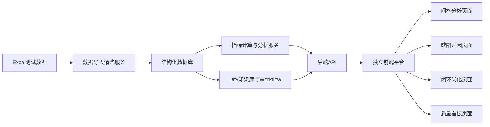

# 制造质量管理平台 Demo 实现方案

## 1. 目标定义

基于 AI 构建一个面向整车制造业的制造质量管理平台 Demo，优先完成以下三个核心模块：

1. 智能问答分析模块
2. 缺陷归因分析模块
3. 智能闭环优化模块

实现要求：

- 以 [`Dify`](plans/manufacturing-quality-platform-plan.md) 作为 AI 编排核心
- 使用测试数据，数据源为 Excel
- 提供独立前端界面
- 支持图表看板展示
- 输出一个可演示、可扩展到未来自部署场景的 Demo 架构

---

## 2. 结论先行：Dify 是否适合

### 2.1 适合的部分

对于当前阶段的 Demo，[`Dify`](plans/manufacturing-quality-platform-plan.md) 是合适的，原因如下：

- 适合快速搭建 AI 应用原型
- 支持 Workflow 编排，便于拆分问答、归因、建议生成等链路
- 支持知识库、工具调用、结构化输出
- 适合作为独立前端的 AI 中台，通过 API 被前端调用
- 后续可以从云端试用平滑过渡到自部署 Docker 版本

### 2.2 不适合单独承担的部分

[`Dify`](plans/manufacturing-quality-platform-plan.md) 不应单独承担以下职责：

- 不适合作为主数据平台
- 不适合作为复杂 BI 看板引擎
- 不适合作为生产级规则引擎和流程引擎
- 不适合直接替代 MES、QMS、LES、SPC 等工业系统

### 2.3 推荐定位

推荐把 [`Dify`](plans/manufacturing-quality-platform-plan.md) 定位为：

- AI 决策与分析中枢
- 问答与推理编排层
- 归因分析和闭环建议生成层

而不是：

- 全量业务系统后端
- 数据仓库
- 图表展示前端

### 2.4 推荐结论

**最终建议：采用 Dify + 独立前后端 + Excel 测试数据适配层 的方式做 Demo。**

即：

- [`Dify`](plans/manufacturing-quality-platform-plan.md)：负责 AI Workflow、知识库、问答和推理
- Python/FastAPI 服务：负责 Excel 导入、数据清洗、指标计算、图表接口
- React 前端：负责业务界面和图表看板
- PostgreSQL 或 SQLite：保存结构化 Demo 数据

---

## 3. 推荐总体架构

## 3.1 架构说明



### 3.2 组件划分

#### A. 数据层

用于承接 Excel 测试数据，形成可查询的结构化数据集。

建议包括：

- 车辆主表
- 工位质检记录表
- 缺陷记录表
- 返修记录表
- 供应商批次表
- 闭环措施表

#### B. 服务层

建议拆为两部分：

1. 数据服务
   - Excel 上传
   - 数据映射
   - 指标统计
   - 图表数据接口
   - 与 Dify 交互时提供结构化上下文

2. AI 服务
   - Dify Workflow API 调用
   - 问答上下文拼接
   - 归因分析结果解析
   - 闭环建议结构化输出

#### C. 应用层

独立前端界面分四个页面：

- 首页驾驶舱
- 智能问答分析
- 缺陷归因分析
- 智能闭环优化

---

## 4. Demo 技术栈建议

## 4.1 AI 与编排

- Dify 自部署版
- 模型可选：
  - 通义千问
  - DeepSeek
  - Anthropic 兼容模型
  - 本地模型如 Qwen 部署版

建议 Demo 先使用稳定的云模型接口，后续切换到自部署模型。

## 4.2 后端

建议使用：

- Python
- FastAPI
- pandas
- openpyxl
- SQLAlchemy
- PostgreSQL 或 SQLite

原因：

- Excel 处理方便
- 和 Dify 集成简单
- 适合快速构建数据接口与分析服务

## 4.3 前端

建议使用：

- React
- Ant Design
- ECharts
- Axios

原因：

- 适合快速搭建企业级管理界面
- 图表能力成熟
- 便于后续扩展权限、筛选器、详情页

---

## 5. Demo 业务范围建议

建议将 Demo 先聚焦在整车制造的总装和内外饰质检场景。

### 5.1 建议场景

- 总装终检
- 内饰装配质检
- 外观缺陷质检
- 返修闭环跟踪
- 供应商零部件质量追溯

### 5.2 建议核心对象

- 车辆 VIN
- 车型
- 生产线
- 工位
- 班组
- 检验员
- 缺陷类型
- 缺陷等级
- 责任环节
- 供应商
- 零部件批次
- 返修措施
- 闭环状态

---

## 6. Excel 测试数据设计方案

建议准备一个 Excel 文件，包含多个 Sheet。

## 6.1 Sheet 设计

### Sheet1: 车辆基础信息 vehicle_info

字段建议：

- vin
- model_code
- vehicle_type
- order_no
- production_date
- shift
- line_name
- workshop

### Sheet2: 质检记录 inspection_records

字段建议：

- inspection_id
- vin
- station_code
- station_name
- inspector
- inspection_time
- result
- defect_count
- defect_level
- quality_score

### Sheet3: 缺陷明细 defect_records

字段建议：

- defect_id
- inspection_id
- vin
- defect_code
- defect_name
- defect_category
- defect_desc
- defect_level
- part_code
- part_name
- position
- supplier_name
- batch_no
- detected_station
- suspected_process
- suspected_team
- rework_required
- defect_time

### Sheet4: 返修闭环 rework_actions

字段建议：

- action_id
- defect_id
- vin
- action_type
- action_owner
- action_department
- action_desc
- due_date
- status
- actual_finish_date
- verification_result

### Sheet5: 知识规则 quality_knowledge

字段建议：

- knowledge_id
- defect_name
- typical_causes
- recommended_actions
- preventive_actions
- applicable_model
- applicable_station

## 6.2 测试数据规模建议

Demo 建议准备：

- 300 到 1000 台车辆
- 1000 到 3000 条质检记录
- 500 到 2000 条缺陷记录
- 200 到 500 条闭环措施记录

这样既能出图，也能支撑归因分析。

## 6.3 数据特征设计建议

为了让 AI 分析更有价值，测试数据必须带有规律，而不是纯随机。

建议人为构造以下模式：

- 某车型在某工位的缺陷率明显升高
- 某供应商批次关联多个外观缺陷
- 某班组夜班问题更集中
- 某零部件在特定时间段出现波动
- 某类缺陷反复出现但闭环措施无效

这些模式会让问答、归因和闭环优化看起来更真实。

---

## 7. 三大功能模块设计

## 7.1 智能问答分析模块

### 目标

让质量经理、工艺工程师、班组长通过自然语言查询质量情况。

### 示例问题

- 最近一周总装终检的 TOP5 缺陷是什么
- 哪个车型的内饰装配不良率最高
- 夜班和白班的质量表现差异如何
- 某供应商批次是否导致异常波动
- 某 VIN 历史检验和返修记录是什么

### 实现方式

用户从前端输入问题，后端执行以下步骤：

1. 判断问题类型
2. 检索结构化数据
3. 组织统计结果
4. 调用 Dify 生成解释性回答
5. 返回文本结论 + 图表数据 + 明细表格

### 输出形式

- 结论摘要
- 指标解释
- 趋势图
- 明细列表
- 建议追问问题

---

## 7.2 缺陷归因分析模块

### 目标

针对某类缺陷或某次异常，自动分析最可能的责任环节与原因组合。

### 分析对象

可按以下维度发起归因：

- 按缺陷类型
- 按车型
- 按工位
- 按供应商
- 按时间段
- 按 VIN

### 推荐归因框架

采用 人机料法环测 的质量分析框架：

- 人：班组、检验员、作业员熟练度
- 机：设备状态、工装夹具
- 料：供应商、批次、部件型号
- 法：工艺参数、作业标准、检验规则
- 环：温湿度、班次、现场环境
- 测：检测标准、抽检频次、误判漏判

### 实现方式

后端先做数据侧候选因子筛选，再调用 Dify 做解释性归因。

推荐步骤：

1. 筛选异常样本集
2. 计算关联特征
3. 识别高风险因子
4. 将候选因子送入 Dify
5. 输出归因结论与置信说明

### 输出形式

- 主要原因排序
- 因果解释
- 证据数据
- 风险等级
- 建议排查顺序

---

## 7.3 智能闭环优化模块

### 目标

在识别问题后，自动给出整改建议、责任分配和验证方案。

### 典型输出

- 建议的临时遏制措施
- 根因验证动作
- 长期预防措施
- 建议责任部门
- 计划完成时间
- 验证指标

### 实现方式

由 Dify 基于以下输入生成：

- 缺陷描述
- 归因分析结果
- 历史知识库
- 既往闭环成效
- 标准作业和工艺规则

### 输出结构建议

建议输出为 JSON 结构，字段如下：

- issue_summary
- containment_action
- root_cause_action
- preventive_action
- owner_department
- owner_role
- kpi_to_verify
- expected_result
- priority

这样便于前端卡片化展示。

---

## 8. Dify 设计方案

## 8.1 推荐不是一个应用全包，而是三个应用或三个 Workflow

建议：

- 一个问答 Workflow
- 一个归因分析 Workflow
- 一个闭环优化 Workflow

如果需要统一入口，可在前端做路由聚合。

## 8.2 Dify 中的能力划分

### 应用一：质量智能问答

输入：

- 用户问题
- 查询条件
- 后端返回的结构化统计数据
- 质量知识库检索结果

输出：

- 面向业务人员的自然语言解释
- 风险提示
- 建议追问

### 应用二：缺陷归因分析

输入：

- 缺陷样本摘要
- 相关维度统计结果
- 高风险因子列表
- 知识库中的典型根因经验

输出：

- 归因排序
- 证据说明
- 风险等级
- 下一步建议

### 应用三：闭环优化建议

输入：

- 异常问题摘要
- 归因结果
- 历史整改案例
- 标准作业知识

输出：

- 整改方案
- 责任建议
- 时限建议
- 验证方案
- 预防措施

## 8.3 Dify 知识库内容建议

导入内容包括：

- 缺陷分类字典
- 典型缺陷与标准描述
- 8D 问题解决模板
- 5Why 模板
- FMEA 常见失效模式摘要
- 工艺规范摘要
- 质量管理制度摘要
- 历史案例模板数据

## 8.4 Dify 的边界

不要把 Excel 原始大表直接全部丢给 Dify。

正确方式应为：

- Excel 先入库
- 后端做查询聚合
- 只把与当前问题相关的摘要、统计、样本和知识片段送入 Dify

---

## 9. 独立前端界面方案

## 9.1 页面结构建议

### 页面一：首页驾驶舱

展示：

- 今日质检总数
- 今日缺陷数
- 缺陷率趋势
- TOP 缺陷类型
- TOP 工位异常
- 供应商质量分布
- 闭环完成率

### 页面二：智能问答分析

展示：

- 问题输入框
- 推荐问题
- AI 结论区
- 图表区
- 明细数据表

### 页面三：缺陷归因分析

展示：

- 条件筛选区
- 异常对象摘要
- 归因树或原因排序
- 证据图表
- 建议排查动作

### 页面四：智能闭环优化

展示：

- 当前问题摘要
- AI 整改建议
- 责任人建议
- 节点跟踪
- 验证指标卡片

## 9.2 图表建议

使用 [`ECharts`](plans/manufacturing-quality-platform-plan.md) 展示：

- 趋势折线图
- 缺陷分布柱状图
- 工位热力图
- 班组对比图
- 供应商帕累托图
- 闭环漏斗图

---

## 10. 后端接口设计建议

## 10.1 数据接口

- `/api/upload/excel`
- `/api/dashboard/summary`
- `/api/dashboard/trend`
- `/api/dashboard/top-defects`
- `/api/dashboard/station-analysis`
- `/api/dashboard/supplier-analysis`

## 10.2 AI 接口

- `/api/ai/qa`
- `/api/ai/root-cause`
- `/api/ai/closed-loop`

## 10.3 返回结构建议

统一结构：

```json
{
  "code": 200,
  "message": "success",
  "data": {}
}
```

---

## 11. Demo 实施步骤

## 11.1 第一步：构造测试数据

产出：

- 一个整车制造质量 Excel 文件
- 5 个 Sheet
- 含明显异常模式

## 11.2 第二步：搭建数据服务

产出：

- Excel 导入脚本
- 数据表结构
- 查询和统计 API

## 11.3 第三步：配置 Dify

产出：

- 3 个 Workflow
- 1 个知识库
- 结构化输出模板

## 11.4 第四步：开发前端

产出：

- 首页驾驶舱
- 问答页
- 归因页
- 闭环页

## 11.5 第五步：联调与演示脚本

产出：

- 演示路径
- 示例问题集
- 示例异常场景

---

## 12. 推荐 Demo 演示路径

建议演示时按以下顺序进行：

1. 上传 Excel 测试数据
2. 进入首页看板查看整体质量态势
3. 在智能问答页提问最近一周哪个工位问题最多
4. 进入归因分析页查看某缺陷的主要可能原因
5. 进入闭环优化页查看 AI 给出的整改和预防方案
6. 展示从问题识别到闭环建议的完整链路

---

## 13. 风险与注意事项

### 13.1 数据质量风险

如果测试数据是纯随机，AI 输出会像空谈，缺乏说服力。

### 13.2 Dify 幻觉风险

归因和整改建议必须基于结构化数据摘要和知识库约束，不能只靠模型自由发挥。

### 13.3 前端期望管理

Demo 阶段应强调：

- 这是 AI 辅助决策平台
- 不是完全自动替代质量工程师
- AI 输出需要可解释、可追溯

### 13.4 未来生产化建议

未来若真正落地，建议升级为：

- Dify 负责 AI 编排
- 数据中台负责治理
- BI 工具负责高复杂度报表
- 流程引擎负责闭环审批
- 工业系统对接 MES/QMS/SPC/ERP

---

## 14. 最终推荐方案

### 推荐方案一句话概括

**用 Dify 做 AI 大脑，用 FastAPI 做数据和接口层，用 React 做独立平台前端，用 Excel 测试数据驱动整车制造质量管理 Demo。**

### 推荐实现组合

- AI 编排：Dify
- 数据处理：Python + pandas
- 后端接口：FastAPI
- 前端展示：React + Ant Design + ECharts
- 数据存储：SQLite Demo 起步，后续切 PostgreSQL
- 数据源：Excel 多 Sheet 测试数据

---

## 15. 下一步执行建议

如果按这个方案推进，下一阶段应进入实现模式，优先落地以下内容：

1. 生成 Excel 测试数据样例
2. 设计数据库表结构
3. 搭建 FastAPI Demo 服务
4. 设计 Dify 三个 Workflow 的 Prompt 和输入输出
5. 搭建 React 前端原型
